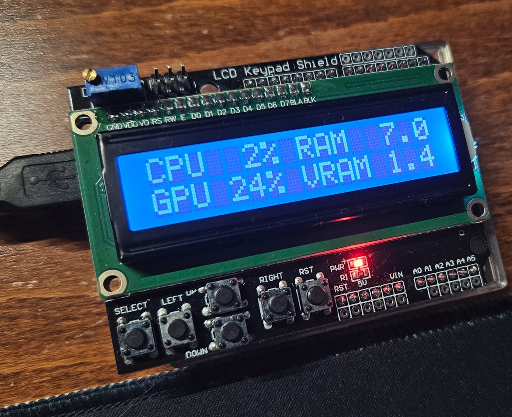

# Statino

I sometimes check the computer's resource usage, but I wanted not to take up the view on the display. So I thought I could use Arudino with an LCD hat for this. 


## Setting up

Hardware needed:
* Arduino Uno R3 board
* LCD hat (shopping link: [botland](https://botland.com.pl/arduino-shield-klawiatury-i-wyswietlacze/14307-lcd-keypad-shield-wyswietlacz-dla-arduino-iduino-st1113-5903351241793.html))

Application works on Ubuntu 24 / Windows 11, Python 3.12 was tested.

**On Windows CPU% is incorrect, see [psutil#2467](https://github.com/giampaolo/psutil/issues/2467)**

Install python requirements:
```bash
python -m pip install requirements.txt
```

### Getting serial number of your board

In order launch the script after login I came up with idea to use serial number to identify the board, instead of relying on port numbers.

```bash
$ python find_serial_number.py 
5563931383235150A122
Arduino Srl
```

After getting your serial number **remember to modify default serial number in function `get_arduino` (stats.py:80)**

Then you can run the script:
```bash
$ python stats.py
Sending to Arduino: 4,0,4.1,1.0;
Sending to Arduino: 1,3,4.1,1.0;
Sending to Arduino: 1,2,4.1,1.0;
Sending to Arduino: 0,2,4.1,1.0;
...
```
### Making the script execute after login

In order to make the application run after login:
* generate an executable with pyinstaller (this works on Windows & Linux)
```bash
$ pyinstaller --onefile stats.py
```
* executable will be available as `./dist/stats` on Linux od `./dist/stats.exe` on Windows.
* follow [this guide](https://help.ubuntu.com/stable/ubuntu-help/startup-applications.html.en) to add executable to Startup Applications on Ubuntu
* follow [this guide](https://support.microsoft.com/en-us/windows/configure-startup-applications-in-windows-115a420a-0bff-4a6f-90e0-1934c844e473) to add executable to Startup Applications on Windows, by pasting it to a `Startup` folder 

### Disclaimer

* The app is designed to work only with nvidia gpu, `pynvml` required `nvidia-smi` to work.
* The app was tested on a PC with single GPU.
* My GPU has 8GB of VRAM, so the numbers fit on the LCD. If you have more than 10GB of VRAM, you should modify somehow how second line is formatted on Arduino to fit the LCD.
* CPU/GPU utilization is limited to 99%, even if PC reports 100% usage, Python script will pass 99% to Arduino, so it all fits on LCD.

## Ideas for further work

* add logging mechanism
* handle Arduino cable reconnect (now it will throw SerialException and kill the app) 
* add support for PC without GPU
* add support for AMD GPU